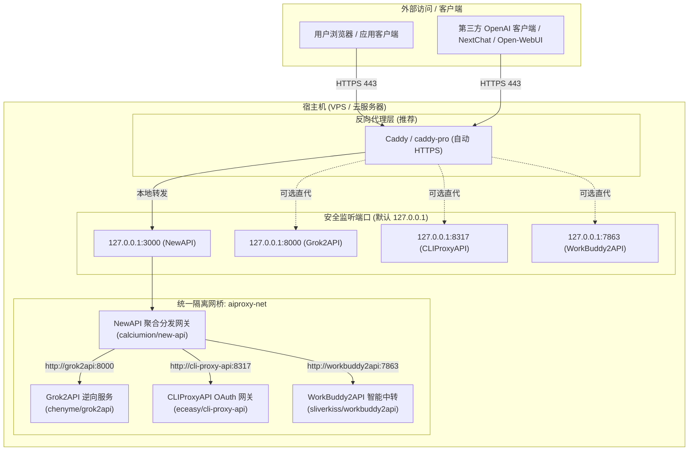

# aiproxy-box (AI 代理全能工具箱) 🚀

<div align="center">

[](LICENSE)
[](https://www.gnu.org/software/bash/)
[](https://www.docker.com/)
[](#)
[-blue.svg)](#)

**面向 VPS 与轻量云服务器的一站式 AI 代理与聚合中转管理工具箱**  
*集 NewAPI、Grok2API、CLIProxyAPI、WorkBuddy2API 于一体，支持模块化按需组合、自适应硬件资源调度、内网安全双模通信与一键 Swap 防爆运维。*

[特性亮点](#-核心特性) • [架构拓扑](#-系统架构) • [一键安装](#-一键安装) • [快捷命令](#-cli-快捷指令) • [NewAPI 渠道配置](#-newapi-渠道配置指引) • [反代部署](#-反向代理与-https) • [常见问题](#-常见问题-faq)

</div>

---

## 🌟 核心特性

- 🧩 **模块化自由组装**：可在 **NewAPI**、**Grok2API**、**CLIProxyAPI**、**WorkBuddy2API** 4 大核心服务中按需勾选启用。底层动态拼装单一标准 `docker-compose.yml`，告别冗余镜像占用。
- ⚡ **硬件探测与自适应 OOM 防护**：自动探测物理内存与 Swap。对于小内存 VPS（<= 1.5GB），动态注入容器内存上限（`mem_limit`）并提醒一键挂载 Swap，保障宿主机 SSH 永不掉线。
- 🔒 **安全双模网络架构**：
  - **安全模式（默认）**：宿主机端口仅绑定 `127.0.0.1`，容器间加入 `aiproxy-net` 桥接内网，API 密钥完全隐匿于内网之中，零公网暴露风险；
  - **公网模式**：一键切换绑定 `0.0.0.0`，适合临时调试或直接对外提供端点。
- 🛡️ **经典运维踩坑点自动修复**：
  - 自动注入日志滚动策略（`max-size: 20m, max-file: 3`），彻底规避长时间运行容器爆满磁盘；
  - 自动纠正 WorkBuddy2API 的 `uid: 10001` 目录所有权，彻底根绝账号数读取为 0 的权限错误。
- 🎮 **现代字符终端看板 (TUI)**：对标 `3x-ui` 与 `caddy-pro` 交互风格，提供高颜值彩色状态看板、实时 CPU/内存占用监控与日志追踪。
- 🔗 **一键集成与渠道直连**：内置 NewAPI 渠道卡片生成器、容器内网 `curl` 连通性测试工具与 Caddyfile 反代配置生成器。
- 🚀 **全局快捷命令**：安装即自动注册全局指令 `aiproxy`，任意路径输入回车即可唤出管理菜单。

---

## 🏗️ 系统架构



---

## 🚀 一键安装

### 1. 极速在线安装 (推荐)

在您的 Linux VPS (Ubuntu / Debian / CentOS / Rocky 等) 上以 `root` 用户运行以下命令：

```bash
curl -fsSL https://raw.githubusercontent.com/aiproxy-box/aiproxy-box/main/install.sh | bash
```

> 脚本将自动安装基础依赖、配置 Docker 运行时环境、克隆项目至 `/opt/aiproxy-box` 并注册 `/usr/local/bin/aiproxy` 全局软链接。

### 2. Git 手动克隆部署

```bash
# 克隆仓库
git clone https://github.com/aiproxy-box/aiproxy-box.git /opt/aiproxy-box
cd /opt/aiproxy-box

# 赋予执行权限并建立全局快捷命令
chmod +x aiproxy.sh
ln -sf /opt/aiproxy-box/aiproxy.sh /usr/local/bin/aiproxy

# 启动管理控制台
aiproxy
```

---

## 🎮 CLI 快捷指令

无需记忆复杂路径，在终端任意位置均可使用 `aiproxy` 命令：

| 命令 | 说明 |
| :--- | :--- |
| `aiproxy` 或 `aiproxy menu` | 唤起彩色交互式 TUI 主菜单 |
| `aiproxy status` | 快速输出当前各组件状态与系统资源占用 |
| `aiproxy start [服务名]` | 启动全部（或指定如 `grok2api`）容器 |
| `aiproxy stop [服务名]` | 停止全部（或指定）容器 |
| `aiproxy restart [服务名]` | 重启全部（或指定）容器 |
| `aiproxy logs [服务名]` | 实时查看聚合（或指定如 `new-api`）日志 |
| `aiproxy test` | 立即执行内网与端口健康连通性测试 |
| `aiproxy update` | 一键拉取最新镜像并平滑重建已启用容器 |
| `aiproxy backup` | 快速将配置文件、凭据与数据库打包为 `.tar.gz` |
| `aiproxy help` | 输出命令行参数使用帮助 |

---

## 📋 NewAPI 渠道配置指引

当您同时启用 NewAPI 与各后端服务时，推荐直接使用 **Docker 内网别名** 接入。内网通信无公网流量损耗、无外部嗅探风险且延迟最低：

### 1. Grok2API (Grok 逆向集群)
- **渠道类型**：`OpenAI`
- **渠道名称**：`Grok2API-内网集群`
- **代理地址 (Base URL)**：`http://grok2api:8000` *(如果跨机器部署填 `http://宿主机IP:8000`)*
- **密钥 (API Key)**：在 `data/grok2api/config.yaml` 或管理控制台配置的 Key（默认可通过后台免密或自定义配置）
- **推荐模型**：`grok-3`, `grok-3-deepsearch`, `grok-3-reasoning`, `grok-2`, `grok-2-imageGen`

### 2. CLIProxyAPI (Claude / Codex / GrokBuild)
- **渠道类型**：`OpenAI` 或 `Anthropic` (根据绑定的凭据类型选择)
- **渠道名称**：`CLIProxyAPI-网关`
- **代理地址 (Base URL)**：`http://cli-proxy-api:8317`
- **密钥 (API Key)**：`data/cliproxy/config.yaml` 中设置的 Key（预设为 `sk-cliproxy-default-key`）
- **推荐模型**：`claude-3-7-sonnet`, `claude-3-5-sonnet`, `gpt-4o`, `o1`, `gemini-2.5-pro`
- **凭据管理后台**：访问 `http://服务器IP:8317/management.html`

### 3. WorkBuddy2API (Gemini / Claude 多功能网关)
- **渠道类型**：`OpenAI`
- **渠道名称**：`WorkBuddy2API-节点`
- **代理地址 (Base URL)**：`http://workbuddy2api:7863`
- **密钥 (API Key)**：`data/workbuddy/config.json` 中的 `api_key`（预设为 `sk-workbuddy-default-key`）
- **推荐模型**：`gemini-2.5-pro`, `gemini-2.5-flash`, `claude-3-7-sonnet`, `claude-3-5-sonnet`

> 💡 **连通性校验**：进入菜单选项 `[7]`，选择 `1. 执行内网与宿主连通性实时测试`，脚本将自动在 `new-api` 容器内发起探测并返回 HTTP 状态码。

---

## 🔒 反向代理与 HTTPS

推荐通过 [Caddy](https://caddyserver.com/) 实现自动化 SSL 证书申请与反向代理。运行菜单 `[8] 反向代理助手`，输入您的域名（如 `example.com`），即可生成开箱即用的配置代码：

```caddyfile
# NewAPI 统一中转面板 (主域名或独立 API 子域)
api.example.com {
    reverse_proxy 127.0.0.1:3000
}

# Grok2API 独立接口 (可选)
grok.example.com {
    reverse_proxy 127.0.0.1:8000
}

# CLIProxyAPI 控制台与接口 (可选)
cliproxy.example.com {
    reverse_proxy 127.0.0.1:8317
}

# WorkBuddy2API 独立接口 (可选)
workbuddy.example.com {
    reverse_proxy 127.0.0.1:7863
}
```

若系统中已存在 `/etc/caddy/Caddyfile`，助手可支持一键将配置追加写入并重载 Caddy 服务。

---

## ❓ 常见问题 (FAQ)

### Q1: 运行提示物理内存不足，容器容易退出怎么办？
**A**: 小内存 VPS（如 1G / 1.5G 内存）在多容器并发时可能被系统 OOM-Killer 强杀。  
1. 进入菜单 `[6] 虚拟内存 (Swap) 管理`；  
2. 选择 `2. 一键创建 2GB Swap`（或 4GB）；  
3. 脚本会自动调整 `vm.swappiness=10` 并持久化到 `/etc/sysctl.conf`，大幅提升小内存主机稳定性。同时，`aiproxy-box` 会自动为小内存服务器注入容器内存限制。

### Q2: 宿主机外部为什么无法直接访问 3000 / 8000 端口？
**A**: 项目默认启用**安全双模**（绑定 `127.0.0.1`），容器仅对本机和反向代理开放，彻底避免公网端口扫描攻击。  
- 如果需要公网直接访问：进入菜单 `[5] 网络监听模式切换`，切换为 `0.0.0.0 (公网直开)` 即可；  
- 如果需要生产环境稳定使用：推荐保持 `127.0.0.1` 并配合 Caddy / Nginx 配置域名与 SSL 访问。

### Q3: WorkBuddy2API 登录账号后为什么提示“账号数为 0”？
**A**: WorkBuddy2API 容器内部以非 root 用户（`uid: 10001`）运行。若在宿主机使用 root 用户创建凭证目录，容器将无权读取或写入刷新令牌。  
`aiproxy-box` 部署与生成时已内置自动执行 `chown -R 10001:10001 data/workbuddy/auths data/workbuddy/data`，彻底修复了该权限陷阱。

### Q4: 如何迁移或备份现有配置与数据？
**A**:  
1. 在源服务器执行 `aiproxy backup`，将在项目目录下生成 `aiproxy-box-backup-YYYYMMDD_HHMMSS.tar.gz`；  
2. 将压缩包拷贝到新服务器的 `/opt/aiproxy-box/`；  
3. 解压并执行 `aiproxy start` 即可无缝恢复所有配置、凭据与 SQLite 数据库。

---

## 📄 开源许可证

本项目基于 [MIT License](LICENSE) 开源发布。
欢迎提交 Issue 和 Pull Request 共同完善！
